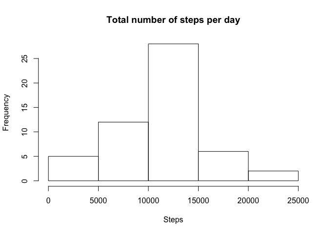
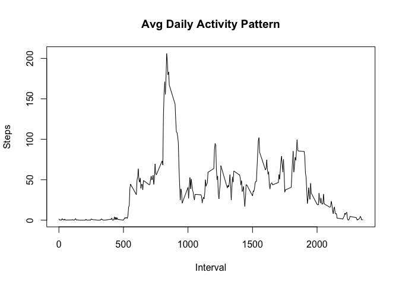
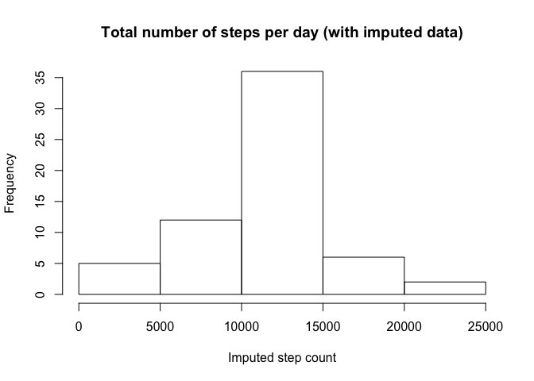

# Reproducible Research: Peer Assessment 1


```r
#Load libraries
library(ggplot2)
library(lattice)
```

## Loading and preprocessing the data
Show any code that is needed to
1. Load the data (i.e. 𝚛𝚎𝚊𝚍.𝚌𝚜𝚟())
2. Process/transform the data (if necessary) into a format suitable for your analysis

```r
dfActivity <- read.csv("./data/activity.csv")
```


## What is mean total number of steps taken per day?
1. Calculate the total number of steps taken per day

```r
stepsperday <- aggregate(steps ~ date, data = dfActivity, sum)
```

2. Make a histogram of the total number of steps taken each day

```r
hist(stepsperday$steps, xlab = "Steps", main = "Total number of steps per day")
```

<!-- -->

3. Calculate and report the mean and median of the total number of steps taken per day

```r
mean(stepsperday$steps)
```

```
## [1] 10766.19
```

```r
median(stepsperday$steps)
```

```
## [1] 10765
```


## What is the average daily activity pattern?
0. Compute the mean steps per interval

```r
stepsperinterval <- aggregate(steps ~ interval, data = dfActivity, mean)
```

1. Make a time series plot (i.e. 𝚝𝚢𝚙𝚎 = "𝚕") of the 5-minute interval (x-axis) and the average number of steps taken, averaged across all days (y-axis)

```r
plot(stepsperinterval$interval, stepsperinterval$steps, type = "l", xlab = "Interval", ylab = "Steps", main = "Avg Daily Activity Pattern")
```

<!-- -->

2. Which 5-minute interval, on average across all the days in the dataset, contains the maximum number of steps?

```r
stepsperinterval[which.max(stepsperinterval$steps),]
```

```
##     interval    steps
## 104      835 206.1698
```


## Imputing missing values
1. Calculate and report the total number of missing values in the dataset (i.e. the total number of rows with 𝙽𝙰s)

```r
colSums(is.na(dfActivity))
```

```
##    steps     date interval 
##     2304        0        0
```

2. Devise a strategy for filling in all of the missing values in the dataset. 

```r
#create a interval db of mean steps per interval; impute using mean steps per interval
meanstepdb <- as.matrix(stepsperinterval$steps, nrow = length(stepsperinterval$steps), ncol = 1)
rownames(meanstepdb) <- stepsperinterval$interval
colnames(meanstepdb) <- "steps"
```

3. Create a new dataset that is equal to the original dataset but with the missing data filled in.

```r
impActivity <- dfActivity
colSums(is.na(impActivity)) #check NAs before impute
```

```
##    steps     date interval 
##     2304        0        0
```

```r
impRows <- which(is.na(impActivity$steps))
impActivity[impRows, "steps"] <- meanstepdb[as.character(impActivity[impRows, "interval"]),1]
colSums(is.na(impActivity)) #check NA's after impute
```

```
##    steps     date interval 
##        0        0        0
```

```r
str(impActivity)
```

```
## 'data.frame':	17568 obs. of  3 variables:
##  $ steps   : num  1.717 0.3396 0.1321 0.1509 0.0755 ...
##  $ date    : Factor w/ 61 levels "2012-10-01","2012-10-02",..: 1 1 1 1 1 1 1 1 1 1 ...
##  $ interval: int  0 5 10 15 20 25 30 35 40 45 ...
```

4. Make a histogram of the total number of steps taken each day and Calculate and report the mean and median total number of steps taken per day. 

```r
impStepsPerDay <- aggregate(steps ~ date, data = impActivity, sum)
hist(impStepsPerDay$steps, xlab = "Imputed step count", main = "Total number of steps per day (with imputed data)")
```

<!-- -->

```r
mean(impStepsPerDay$steps)
```

```
## [1] 10766.19
```

```r
median(impStepsPerDay$steps)
```

```
## [1] 10766.19
```

Do these values differ from the estimates from the first part of the assignment? 

```r
mean(impStepsPerDay$steps) - mean(stepsperday$steps)
```

```
## [1] 0
```

```r
median(impStepsPerDay$steps) - median(stepsperday$steps)
```

```
## [1] 1.188679
```

What is the impact of imputing missing data on the estimates of the total daily number of steps?
As noted above, the mean remains the same as the original data. The median of the imputed data differs from the original data.

## Are there differences in activity patterns between weekdays and weekends?
1. Create a new factor variable in the dataset with two levels – “weekday” and “weekend” indicating whether a given date is a weekday or weekend day.

```r
#note: a day is 288 intervals long
impActivity$day <- as.factor(ifelse(weekdays(as.Date(impActivity[,"date"])) %in% c("Saturday", "Sunday"), "weekend", "weekday"))
```

2. Make a panel plot containing a time series plot (i.e. 𝚝𝚢𝚙𝚎 = "𝚕") of the 5-minute interval (x-axis) and the average number of steps taken, averaged across all weekdays or weekends(y-axis)

```r
impStepsPerInterval <- aggregate(steps ~ interval + day, data = impActivity, mean)
xyplot(steps ~ interval | day, data = impStepsPerInterval, layout = c(1,2), type = "l", ylab = "Number of steps")
```

<!-- -->

